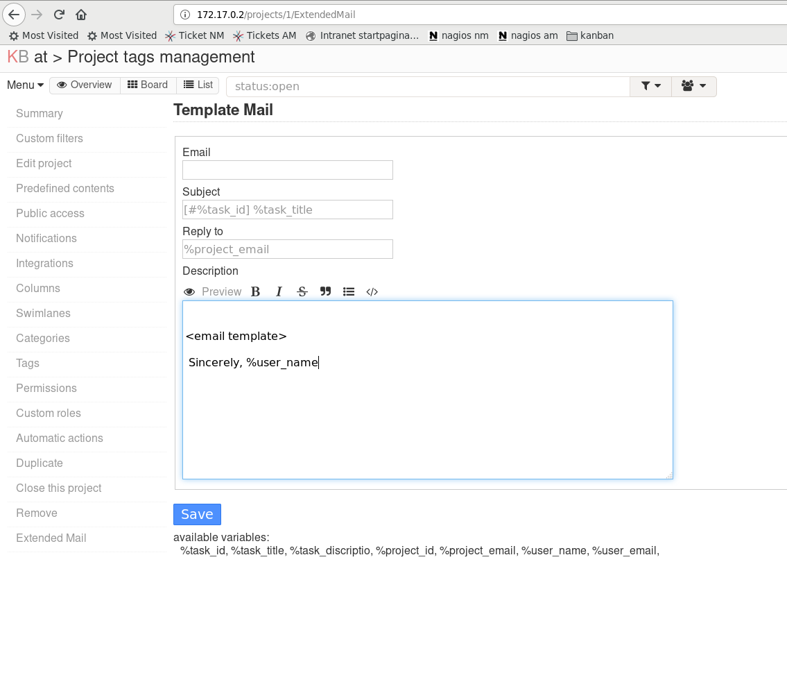

ExtendedMail
==============================

This Plugin adds to Kanboard comment by mail. This makes kanboard more useful as remote support ticketing systeem.
It ads:

* custom reply_to
* configuarble default for(to,subject,reply, bod ) which might include variables

*screenshot*

Author
------

- Rens Sikma
- License MIT

Requirements
------------

- Kanboard >= 1.0.35

Installation
------------

You have the choice between 3 methods:

1. Install the plugin from the Kanboard plugin manager in one click
2. Download the zip file and decompress everything under the directory `plugins/ExtendedMail`
3. Clone this repository into the folder `plugins/ExtendedMail` (not plugins/kanboard-ExtendedMail)

Note: Plugin folder is case-sensitive.

Documentation
-------------

you can change the settings in: project settings -> ExtendedMail (side panel)

available variables you can use:

* %task_id
* %task_title
* %task_description
* %project_id
* %project_email    (you can change this in: edit project)
* %user_name
* %user_email

